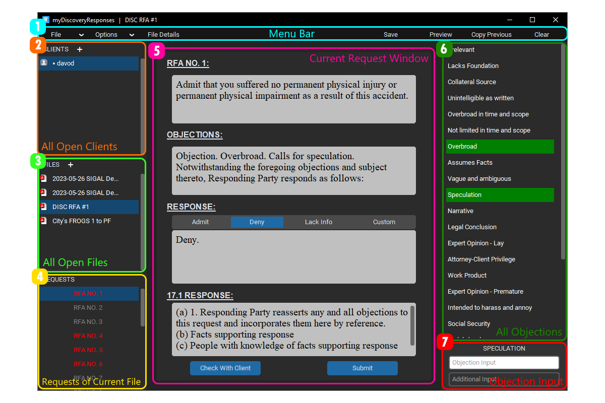

# myDiscoveryResponses
Software for the creation of Discovery Responses
## Installation
### Using Windows Installer
### Downloading Windows EXE directly
### Downloading raw Python Files

## User Guide
### Software Overview

General description of usage here
#### 1. Menu Bar
#### 2. Clients
#### 3. Files
#### 4. Requests
#### 5. Current Request Window
#### 6. All Objections
#### 7. Objections Input

### Usage Examples
#### Importing discovery request files

#### Exporting discovery response files

#### Loading client feedback

#### Editing Objections

#### Change firm details

#### Create, save and load clients

#### Change theme

#### Change hotkeys
