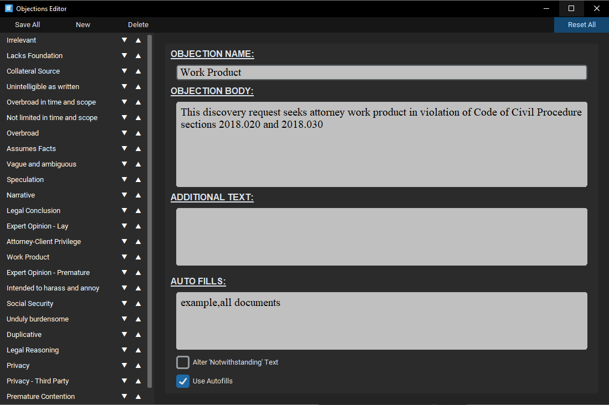
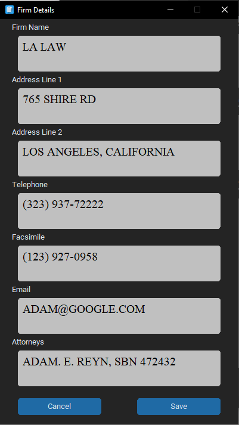
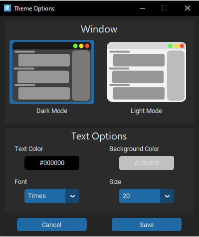
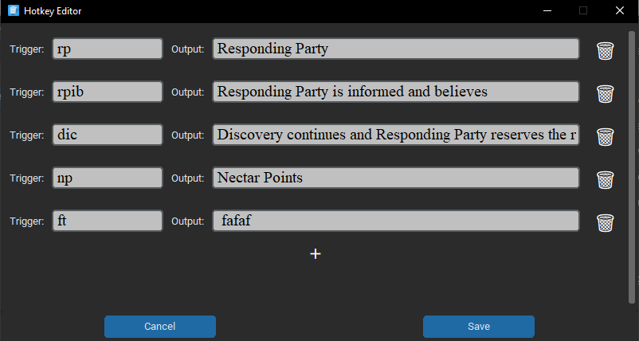

<br />
The bespoke software, myDiscoveryResponses, is designed for the production and editing of discovery responses. Using the software, you can load discovery request pdf's of type: 
> Requests for Admissions (RFA)
> <br />
> Demands for Production (RFP)
> <br />
> Special Interrogatories (SPROG)
> <br />
> Form Interrogatories (FROG)

These are loaded using natural language processing and OCR techniques, in order to extract the correct requests and file details from the pdf files.
Once loaded, you can move between each request and check off objections; in addition to adding custom responses. When these responses have been created, the file can then be exported as a response word document (DOCX), or saved for future editing as a .discovery file.

## Installation
### Using Windows Installer
1. Download the ```setup.exe```
2. Run the setup.exe, this will install myDiscoveryResponses in your Local Program Files
3. Run the program from the windows start menu or by using the Desktop Shortcut

### Downloading Windows EXE directly
1. Download the ```myDiscoveryResponses.zip``` file
2. Unzip the file
3. Run ```myDiscoveryResponses.exe``` directly from this folder

### Downloading raw Python Files
1. Ensure that you have Python 3.11 or higher installed
2. Download all of the relevant project files
3. Install the required Python packages using:
```
pip install requirements.txt
```
4. Run the app.py program using:
```
python app.py
```

## Website
Available documentation at:
  https://github.com/RENYREYNOLDSON/myDiscoveryResponses-site.git

## User Guide
### Software Overview

#### 1. Menu Bar
The menu bar is used to navigate through the software and also contains special commands on the left.

#### 2. Clients
Each open client/editor is shown here and they can be swapped between by simply clicking on them. You can drag a file from one client name onto another to move it between them.

#### 3. Files
All of the files for the current client are shown here and can be swapped between by simply clicking on them.

#### 4. Requests
All of the requests for the current file are shown here and can be swapped between by simply clicking them. They are coloured WHITE - Unchanged, GREY - Edited, GREEN - Submitted and RED - Check with Clients.

#### 5. Current Request Window
This window is the editor for the current requests response. Contains the **request**, **objections** and the **response**. For RFA's and RFP's we have additional input options.

#### 6. All Objections
This window contains all of the Objections saved within the software. Left-Click to toggle if it is active for the current request, right-click to edit the objection's parameters.

#### 7. Objections Input
If the objection requires an input then it can be typed in here, there is also an input for an additional input.

---
### Usage Examples

#### Editing Objections
To edit the objections: ```Options -> Objections```. In this window you can save, add, delete, reset and edit the saved objections. Each objection contains:
<br /><br />
> 

**Objection Name:** Name of Objection.
<br />
**Objection Body:** This is the main text that will appear when selected.
<br />
**Additional Text:** This text appears after the main response.
<br />
**Auto Fills:** This is a list of comma seperated terms that will trigger this objection to be automatically selected if present in the request. e.g. ALL documents, ALL photos. NOTE THAT: On submitting a request, any items entered into the objections input will be saved to the autofills and will show here!
<br />
**Alter 'Notwithstanding' Text:** If the objection alters this text
<br />
**Use Autofills:** If the objection actually uses the autofills


#### Change firm details
The firm details are saved to each responses export. To edit the firm details: ```Options -> Firm Details```. If you have a client open then this client will be saved with custom firm details, otherwise these firm details will be the default.

> 

#### Exporting and Loading client feedback
- You can export client feedback by doing ```File -> Export Check with Client```. This will export all of the requests belonging to the client into one DOCX file. These can then be edited by or with the clients and loaded back into the software.
- To load the client feedback do ```File -> Load Client Feedback```, this will insert the responses from the client feedback into the open files (if they are present).

#### Create, save and load clients
- To open request files, you must first create a client. To create a client use ```File -> New Client``` or ```Cntrl-N```.
- To save a client do ```Save```, ```File -> Save Client``` or ```Cntrl-S```. To save as do ```File -> Save Client As```. If you try to close a client without saving you will be prompted to confirm.
- To load a saved client (.discovery file) either open from recents or do ```File -> Open File``` and select the save.

#### Change theme
The theme of the software can be changed using the menu ```Options -> Theme```.
> 

#### Change hotkeys
Each hotkey is a shortcut which when typed into the **response** will insert the full hotkey. e.g. 'rp' -> 'Responding Party'. These can be added and changed by going to ```Options -> Hotkeys```.
> 

## Details
Version: 1.0
<br />
Contact: reynoldson2002@gmail.com
