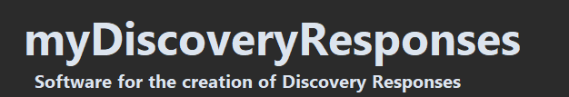

<br />
Software for the creation of Discovery Responses. Load discovery request pdf's of type:
> Requests for Admissions (RFA)
> <br />
> Demands for Production (RFP)
> <br />
> Special Interrogatories (SPROG)
> <br />
> Form Interrogatories (FROG)

Once loaded you can move between each request and apply set objections in addition to custom responses. When these responses have been created, the file can then be exported as a response word document (DOCX).
## Installation
### Using Windows Installer
1. Download the ```setup.exe```
2. Run the setup.exe, this will install myDiscoveryResponses in your Local Program Files
3. Run the program from the windows start menu or by using the Desktop Shortcut

### Downloading Windows EXE directly
1. Download the ```myDiscoveryResponses.zip``` file
2. Unzip the file
3. Run ```myDiscoveryResponses.exe``` directly from this folder

### Downloading raw Python Files
1. Ensure that you have Python 3.11 or higher installed
2. Download all of the relevant project files
3. Install the required Python packages using:
```
pip install requirements.txt
```
4. Run the app.py program using:
```
python app.py
```

## User Guide
### Software Overview

#### 1. Menu Bar
The menu bar is used to navigate through the software and also contains special commands on the left.

#### 2. Clients
Each open client/editor is shown here and they can be swapped between by simply clicking on them. You can drag a file from one client name onto another to move it between them.

#### 3. Files
All of the files for the current client are shown here and can be swapped between by simply clicking on them.

#### 4. Requests
All of the requests for the current file are shown here and can be swapped between by simply clicking them. They are coloured WHITE - Unchanged, GREY - Edited, GREEN - Submitted and RED - Check with Clients.

#### 5. Current Request Window
This window is the editor for the current requests response. Contains the **request**, **objections** and the **response**. For RFA's and RFP's we have additional input options.

#### 6. All Objections
This window contains all of the Objections saved within the software. Left-Click to toggle if it is active for the current request, right-click to edit the objection's parameters.

#### 7. Objections Input
If the objection requires an input then it can be typed in here, there is also an input for an additional input.

---
### Usage Examples
#### Importing discovery request files


#### Exporting discovery response files


#### Loading client feedback


#### Editing Objections


#### Change firm details


#### Create, save and load clients


#### Change theme


#### Change hotkeys


## Details
Version: 1.0
<br />
Contact: reynoldson2002@gmail.com
