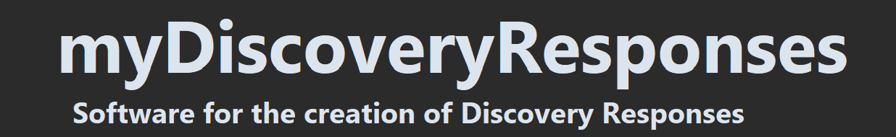

<div align="center">
  <picture>
      
    </picture>
<br />


<h3>
Official website: https://myDiscoveryResponses.com
</h3>
</div>

The bespoke software, myDiscoveryResponses, is designed for the production and editing of discovery responses. Using the software, you can load discovery request pdf's of type: 
> Requests for Admissions (RFA)
> <br />
> Demands for Production (RFP)
> <br />
> Special Interrogatories (SPROG)
> <br />
> Form Interrogatories (FROG)

These are loaded using natural language processing and OCR techniques, in order to extract the correct requests and file details from the pdf files.
Once loaded, you can move between each request and check off objections; in addition to adding custom responses. When these responses have been created, the file can then be exported as a response word document (DOCX), or saved for future editing as a .discovery file.


## Python Env Setup
1. Ensure that you have Python 3.11 or higher installed
2. Download all of the relevant project files
3. Install the required Python packages using:
```
pip install requirements.txt
```
4. Run the app.py program using:
```
python app.py
```

## Website
Available documentation at:
  https://github.com/RENYREYNOLDSON/myDiscoveryResponses-site.git


