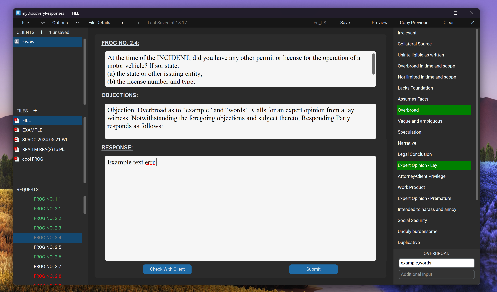

<div align="center">
  <picture>
      
    </picture>
<br />


The current version is (https://mydiscoveryresponses.com/version.txt).


<h3>
Official website: https://myDiscoveryResponses.com
</h3>
</div>



The bespoke software, myDiscoveryResponses, is designed for the production and editing of discovery responses. Using the software, you can load discovery request pdf's of type: 
> Requests for Admissions (RFA)
> <br />
> Demands for Production (RFP)
> <br />
> Special Interrogatories (SPROG)
> <br />
> Form Interrogatories (FROG)

These are loaded using natural language processing and OCR techniques, in order to extract the correct requests and file details from the pdf files.
Once loaded, you can move between each request and check off objections; in addition to adding custom responses. When these responses have been created, the file can then be exported as a response word document (DOCX), or saved for future editing as a .discovery file.


## Python Environment Setup
1. Ensure that you have Python 3.11 or higher installed
2. Clone this git repository
3. Install the required Python packages using:
```
pip install -r requirements.txt
```
4. Run the __main__.py program using:
```
python __main__.py
```
## Creating Installer
1. From within the project folder, run the command:
```
pyinstaller __main__.spec
```
2. Open INNO Compiler Setup and run:
```
Compiler_Script.iss
```
3. You will now be left with myDiscoveryResponsesInstaller.exe
4. Update the websites version.txt
5. Git pull to the website using cpanel
6. Upload the installer to the website
7. Create a new github release

